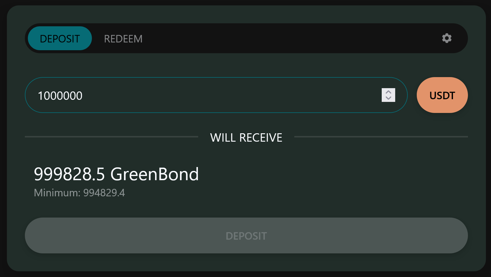
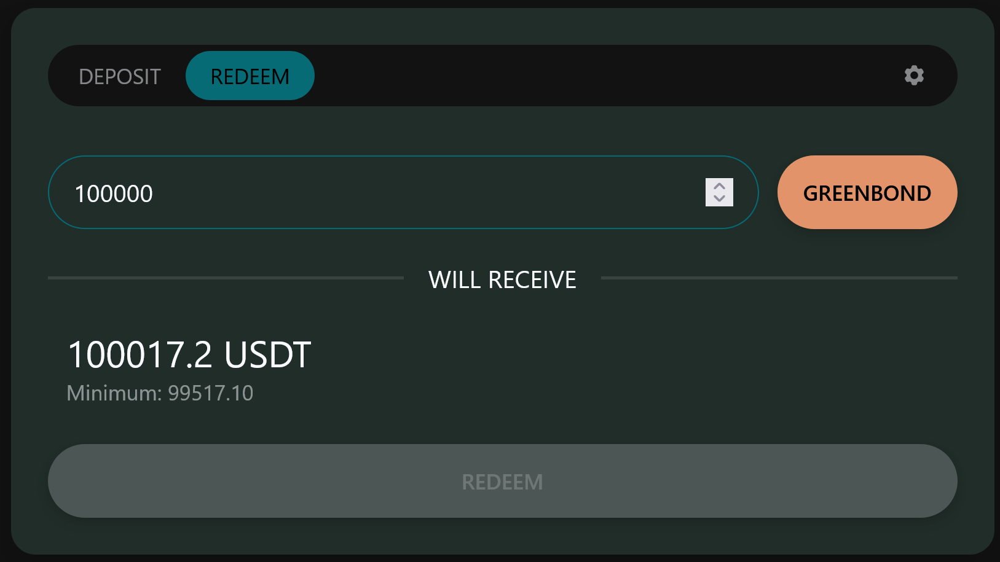

# 🌟 Green Bond V2 🌟

## Table of Contents
1. [Introduction](#introduction)
2. [Getting Started](#getting-started)
   - [Connecting to the Dapp](#connecting-to-the-dapp)
3. [Main Actions](#main-actions)
   - [1. Deposit USDT for gBOND](#1-deposit-usdt-for-gbond)
   - [2. Redeem gBOND for USDT](#2-redeem-gbond-for-usdt)
4. [Stats Page](#stats-page)
5. [External Links](#external-links)
   - [Bridge Assets to Arbitrum](#bridge-assets-to-arbitrum)
   - [Swap Assets on Arbitrum](#swap-assets-on-arbitrum)
6. [Further reading](#further-reading)
7. [Contact Support](#contact-support)

## Introduction

Welcome to the Green Bond V2 - your gateway to decentralized finance green bonds on the Arbitrum network. This user documentation will guide you through the key features and actions available on our platform.

## Getting Started

### Connecting to the Dapp

To start using GreenBondV2, follow these steps:

1. Ensure that you have an Ethereum wallet with funds.
2. Visit [greenchain.capital](https://www.greenchain.capital) in your preferred web browser.
3. Connect your wallet to the dapp by clicking on the "Connect Wallet" button and selecting your wallet provider.

## Main Actions

### 1. Deposit USDT for gBOND

To deposit USDT and acquire gBOND, follow these steps:

1. Navigate to the "Deposit" section on the dapp.
2. Enter the amount of USDT you want to deposit.
3. Confirm the transaction on your wallet.
4. Once the transaction is confirmed, you will receive the equivalent amount of gBOND.

### 2. Redeem gBOND for USDT

To redeem gBOND for USDT, follow these steps:

1. Go to the "Redeem" section on the dapp.
2. Enter the amount of gBOND you want to redeem.
3. Confirm the transaction on your wallet.
4. After the transaction is confirmed, you will receive the corresponding amount of USDT.

## Stats Page

Explore the "Stats" page to track bond investment and rewards:

- Total Amount Invested: View the total USDT deposited.
- Rewards Earned: Monitor the rewards earned from investments.

## External Links

### Bridge Assets to Arbitrum 🌉

Use the following link to bridge assets to Arbitrum:

[Arbitrum Bridge](https://bridge.arbitrum.io/)

### Swap Assets on Arbitrum 🔄

For asset swapping on Arbitrum, use the following link:

[Swap assets on Arbitrum](https://app.balancer.fi/#/arbitrum/swap)

## Further Reading 

- [Technical Overview](TECH_OVERVIEW.md)
- [Project Finance](PROJECT_FINANCE.md)
- [XStructure](XSTRUCTURE.md)
- [Green Governance](GOV.md)

## Contact Support 🤔

For further assistance, reach out to our support team at [info@greenchain.capital](mailto: info@greenchain.capital).
